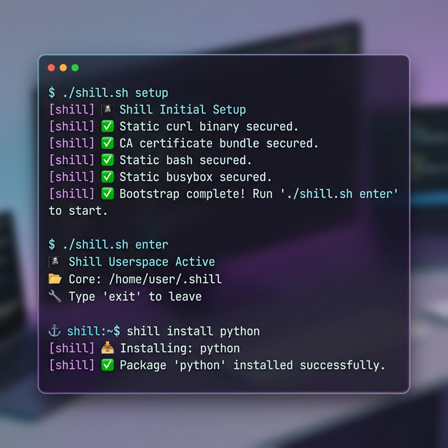

# 🏴‍☠️ Shill — Portable Standarized Userspace



> *"The Stowaway"* — Zero-dependency, self-modifying, procedural Linux environment manager.

Shill is a single POSIX shell script that bootstraps a **fully isolated, portable userspace** on any Linux server — even the most restricted shared hosting. No root, no `sudo`, no package manager required.

## ⚡ Instant Setup

Run this one-liner to download and start Shill immediately:

```bash
curl -fsSL https://raw.githubusercontent.com/milio48/shill/main/shill.sh -o shill.sh && chmod +x shill.sh && ./shill.sh setup
```

*Don't have curl? Use wget:*
```bash
wget -qO shill.sh https://raw.githubusercontent.com/milio48/shill/main/shill.sh && chmod +x shill.sh && ./shill.sh setup
```

## 📦 Package Registry

Install any of these using `./shill.sh install <name>`.

### 🛠️ Developer Tools
| Name | Description |
|------|-------------|
| `node` | Node.js runtime (LTS) + npm & npx |
| `python` | Portable Python 3.13 (standalone musl) |
| `frankenphp` | FrankenPHP standalone server (PHP 8.2) |
| `php` | Static PHP CLI binary (v8.3) |
| `webi` | WebInstall (webinstall.dev) manager |
| `jq` | Lightweight JSON processor |

### 🔧 Utilities
| Name | Description |
|------|-------------|
| `tmux` | Terminal multiplexer |
| `pm2-go` | Process manager in Go (PM2 alternative) |
| `zfetch` | System & Network info fetch script |
| `bench` | System benchmark script (by TeddySun) |
| `yabs` | Yet Another Bench Script (VPS bench) |
| `dufs` | A distinctive file server (static binary) |
| `rsync` | Fast file sync utility |
| `socat` | Multipurpose relay (SOcket CAT) |
| `screen` | GNU Screen terminal multiplexer |
| `yazi` | Blazing fast terminal file manager |
| `lazygit` | Simple terminal UI for git commands |
| `fastfetch` | Like neofetch, but much faster (C) |
| `btop` | A monitor of resources |

### 🛡️ Security & Remote
| Name | Description |
|------|-------------|
| `sshx` | Fast, collaborative terminal sharing |
| `ngrok` | Reverse proxy for local exposure |
| `pinggy` | SSH-based tunnel for local exposure |
| `linpeas` | Privilege escalation enumeration tool |
| `deepce` | Docker enumeration and exploitation tool |
| `dropbearmulti` | SSH server/client (Dropbear) |
| `chisel` | A fast TCP/UDP tunnel over HTTP |
| `ttyd` | Share your terminal over the web |

### 🧪 Experimental
| Name | Description |
|------|-------------|
| `proot-ubuntu` | Lightweight Ubuntu 24.04 (via PRoot) |
| `proot-alpine` | Ultra-lightweight Alpine Linux (via PRoot) |

## 🏗️ Built-in Commands

Shill comes with **300+ standard Linux commands** out of the box (via BusyBox farm), including:
`ls`, `cat`, `grep`, `find`, `ssh` (if installed), `curl`, `tar`, `gzip`, `top`, `vi`, `wget`, `sed`, `awk`, and hundreds more.

## 🎮 Basic Usage

| Command | Action |
|---------|-------------|
| `./shill.sh enter` | Launch interactive shell (with history & colors) |
| `./shill.sh space <cmd>` | Run a single command in Shill environment |
| `./shill.sh install <pkg>` | Install a new package |
| `./shill.sh remove <pkg>` | Remove a package cleanly |
| `./shill.sh ls` | List all available & installed packages |
| `./shill.sh destroy` | Wipe the entire environment (factory reset) |

## 📂 Directory Structure

Setting up Shill is non-destructive. You can install it to the default `~/.shill` or any **custom path** (even on a temporary `/tmp` or a mounted drive).

```
$SHILL_CORE/
├── bin/              # Standalone binaries (bash, curl, packages)
├── etc/              # Configs (cacert.pem, etc.)
├── busybox_links/    # Symlink farm (300+ linux commands)
├── lib/              # Library files & language runtimes
├── cache/            # Temporary download folder
├── .shill_history    # Isolated bash history
└── .shill_rc         # Isolated bash config
```

---
MIT License • Created for the Stowaways.