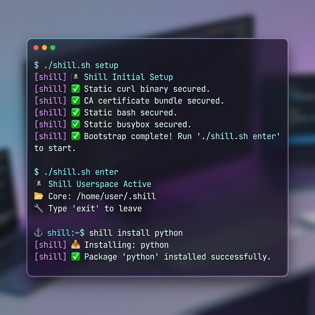

# 🏴‍☠️ Shill — Portable Standarized Userspace



> *"The Stowaway"* — Zero-dependency, self-modifying, procedural Linux environment manager.

Shill is a single POSIX shell script that bootstraps a **portable userspace** on any Linux server — even the most restricted shared hosting. No root, no `sudo`, no package manager required. The shell, its commands, tool configs, caches and prefixes all live inside the core, so nothing leaks into the host's `$HOME`.

## ⚡ Instant Setup

Run this one-liner to download and start Shill immediately:

```bash
curl -fsSL https://raw.githubusercontent.com/milio48/shill/main/shill.sh -o shill.sh && chmod +x shill.sh && ./shill.sh setup
```

*Don't have curl? Use wget:*
```bash
wget -qO shill.sh https://raw.githubusercontent.com/milio48/shill/main/shill.sh && chmod +x shill.sh && ./shill.sh setup
```

## 📦 Package Registry

Install any of these using `./shill.sh install <name>`.

### 🛠️ Developer Tools
| Name | Description |
|------|-------------|
| `node` | Node.js runtime (LTS) + npm, npx & node-gyp headers |
| `bun` | All-in-one JavaScript runtime, package manager & bundler |
| `golang` | Official Go toolchain (compiler + stdlib) |
| `python` | Portable Python 3.13 (adaptive glibc/musl) + uv |
| `toolchain` | Portable C/C++ toolchain (zig cc + make) for native builds |
| `git` | Static git client (self-built, checksum-verified) |
| `frankenphp` | FrankenPHP standalone server (PHP 8.2) |
| `php` | Static PHP CLI binary (v8.3) |
| `webi` | WebInstall (webinstall.dev) manager |
| `pkgx` | Rootless single-binary package runner (provisions tools on demand) |
| `jq` | Lightweight JSON processor |
| `micro` | Modern and intuitive terminal text editor |
| `sqlite3` | Static SQLite3 command-line interface |
### 🔧 Utilities
| Name | Description |
|------|-------------|
| `tmux` | Terminal multiplexer |
| `pm2-go` | Process manager in Go (PM2 alternative, incl. `pm2-go-web`) |
| `zfetch` | System & Network info fetch script |
| `bench` | System benchmark script (by TeddySun) |
| `yabs` | Yet Another Bench Script (VPS bench) |
| `dufs` | A distinctive file server (static binary) |
| `rsync` | Fast file sync utility |
| `socat` | Multipurpose relay (SOcket CAT) |
| `screen` | GNU Screen terminal multiplexer |
| `yazi` | Blazing fast terminal file manager |
| `lazygit` | Simple terminal UI for git commands |
| `fastfetch` | Like neofetch, but much faster (C) |
| `btop` | A monitor of resources |
| `zellij` | Terminal workspace with batteries included |
### 🛡️ Security & Remote
| Name | Description |
|------|-------------|
| `sshx` | Fast, collaborative terminal sharing |
| `ngrok` | Reverse proxy for local exposure |
| `pinggy` | SSH-based tunnel for local exposure |
| `linpeas` | Privilege escalation enumeration tool |
| `deepce` | Docker enumeration and exploitation tool |
| `dropbearmulti` | SSH server/client (Dropbear) |
| `chisel` | A fast TCP/UDP tunnel over HTTP |
| `cloudflared` | Cloudflare Tunnel client (expose local services) |
| `ttyd` | Share your terminal over the web |

### 🧪 Experimental
| Name | Description |
|------|-------------|
| `proot-ubuntu` | Lightweight Ubuntu 24.04 (via PRoot, cwd-preserving) |
| `proot-alpine` | Ultra-lightweight Alpine Linux (via PRoot, cwd-preserving) |

## 🏗️ Built-in Commands

Shill comes with **300+ standard Linux commands** out of the box (via BusyBox farm), including:
`ls`, `cat`, `grep`, `find`, `ssh` (if installed), `curl`, `tar`, `gzip`, `top`, `vi`, `wget`, `sed`, `awk`, and hundreds more.

## 🎮 Basic Usage

| Command | Action |
|---------|-------------|
| `./shill.sh enter` | Launch interactive shell (with history & colors) |
| `./shill.sh space <cmd>` | Run a single command in Shill environment |
| `./shill.sh install <pkg>` | Install a new package |
| `./shill.sh install <pkg>@<ver>` | Install a specific version (where supported) |
| `./shill.sh remove <pkg>` | Remove a package cleanly |
| `./shill.sh ls` | List all available & installed packages |
| `./shill.sh destroy` | Wipe the entire environment (factory reset) |

## 📂 Directory Structure

Setting up Shill is non-destructive. You can install it to the default `~/.shill` or any **custom path** (even on a temporary `/tmp` or a mounted drive).

```
$SHILL_CORE/
├── bin/              # Standalone binaries + package wrappers
├── etc/              # Configs & the env contract (env.sh, pip.conf, npmrc, cacert.pem)
├── busybox_links/    # Symlink farm (300+ linux commands)
├── lib/              # Language runtimes & package payloads (python, go, git, zig, ...)
├── share/            # Shared data
├── cache/            # Downloads and tool caches (pip, npm, uv, go, ...)
├── .shill_history    # Isolated bash history
└── .shill_rc         # Isolated bash config
```

## 🧪 PRoot Environments

`proot-alpine` / `proot-ubuntu` give you a full distro without root. The wrapper keeps your **current directory** (and `$HOME`) visible inside the guest, so paths match the host — no copying files in and out.

```bash
./shill.sh install proot-alpine
proot-alpine                 # interactive shell, starts in your current directory
proot-alpine add git         # apk add
proot-alpine update          # apk update && apk upgrade
proot-alpine run ls -la      # one-off command
```

## 🧑‍💻 Development Recipes

Tool configuration lives inside the core (`etc/env.sh`, sourced on every `enter`), so caches and prefixes stay portable:

```bash
./shill.sh install python     # adaptive glibc/musl build -> prebuilt wheels + uv
./shill.sh install node       # npm prefix/cache in-core + node-gyp headers
./shill.sh install toolchain  # zig cc + make for packages without prebuilt wheels
./shill.sh install git        # static git client (unlocks lazygit)
```

- **Python**: `uv pip install`, `uv venv`, `uv tool install` work out of the box (caches in `cache/uv`, config in `etc/pip.conf`).
- **Node**: `npm i -g <pkg>` installs into `bin/`, the cache stays in `cache/npm`, and native addons compile against `lib/node-gyp`.
- **Bun**: `bun install`, `bun run`, `bun x` — a single-binary npm alternative (cache in `cache/bun`).
- **Go**: `go build` / `go install` work directly; installed binaries land in `bin/` (`GOBIN`).
- **No prebuilt wheel?** `shill install toolchain` exports `CC="zig cc"`, letting `pip` / `node-gyp` / `cgo` build from source without root.
- **Always latest, pinnable**: packages with a versioned upstream follow the newest release by default (`node` tracks the latest LTS); pin anything with `shill install node@20.11.0` (or `pkg@version`).
- **Long tail**: `shill install pkgx` then `pkgx <tool>` (e.g. `pkgx 7z`, `pkgx jq`, `pkgx node@20`) provisions tools on demand without root. `pkgx -Q` lists the pantry.

---
MIT License • Created for the Stowaways.